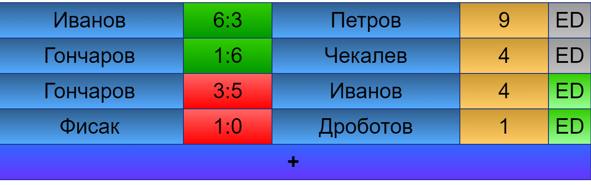

# ok-livescore

livescore -- это площадка, на которой организаторы и игроки любительского турнира по теннису могут отслеживать матчи. Задача
площадки -- автоматизировать обмен информацией о статусе матчей между участниками событий, сократить время ожидания корта

## MVP

Окно для просмотра списка матчей с указанием текущего счета и корта, для организаторов есть возможность редактирования
Окно добавления/редактирования матча(Можно указать имя игрока, кол-во выйгранных геймов, номер корта)

## Визуальная схема фронтенда

## Документация

1. Маркетинг
    1. [Заинтересанты](./docs/01-marketing/02-stakeholders.md)
    2. [Целевая аудитория](./docs/01-marketing/01-target-audience.md)
    3. [Конкурентный анализ](./docs/01-marketing/03-concurrency.md)
    4. [Анализ экономики](./docs/01-marketing/04-economy.md)
    5. [Пользовательские истории](./docs/01-marketing/05-user-stories.md)
2. DevOps
    1. [Схема инфраструктуры](./docs/02-devops/01-infrastruture.md)
    2. [Схема мониторинга](./docs/02-devops/02-monitoring.md)

3. Тесты
	1. [Тесткейсы](./docs/03-tasting/user-story-0001.md)
	
4. Архитектура
   1. [Описание DTO](./docs/04-architecture/01-dto.md)
   2. [Схема архитектуры](./docs/04-architecture/02-archscheme.md)
